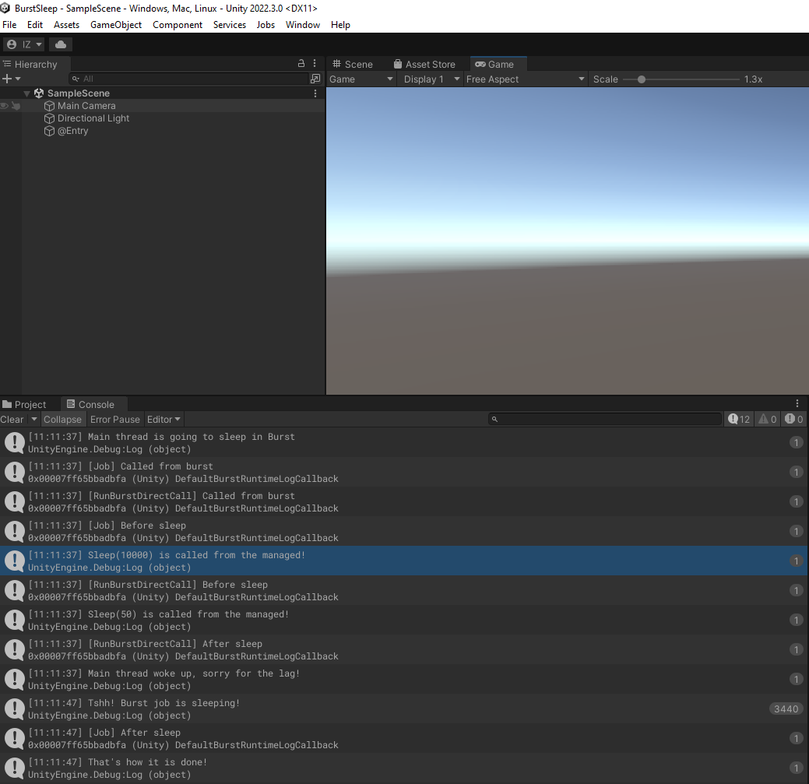

# Burst2ManagedCall
How to call managed functions (like Thread.Sleep) from Burst

This demo contains a few interesting blocks that can be used together with Burst.



## What exactly?

We have a function

```csharp
    private static void SleepManaged(int milliseconds)
    {
        // C# managed land
        Debug.Log($"Sleep({milliseconds}) is called from the managed!");
        
        Thread.Sleep(milliseconds);
    }
```

and we really want to call it from Burst code, not breaking Burst compilation.


## How?

There is a list of blocks we're going to use:

### BurstUtils.IsCalledFromBurst

Will return `true` if it was called from Burst, `false` otherwise.
Implemented using `[BurstDiscard]` trick that hides functions from Burst, but executes them in managed land.

Used to detect if things are the same as we want.

### Burst2ManagedCall<T, Key>

SharedStatic wrapper for `FunctionPointer<T>` that is extracted from the delegate using `T funcPtr = Marshal.GetFunctionPointerForDelegate(delegate_of_type_T)`

### Delegate type + needed attributes

We need to create a delegate for our function `private delegate void SleepManagedDelegate(int milliseconds);` and mark the delegate with `cdecl` and the function with `MonoPInvokeCallback`:

```csharp
    [UnmanagedFunctionPointer(CallingConvention.Cdecl)]
    private delegate void SleepManagedDelegate(int milliseconds);
    
    [AOT.MonoPInvokeCallback(typeof(SleepManagedDelegate))]
    private static void SleepManaged(int milliseconds)
```

### Initialize things from the managed C#

```csharp
    [BurstDiscard]
    public static void InitializeFromManaged()
    {
        Burst2ManagedCall<SleepManagedDelegate, SleepManagedDelegateKey>.InitIfNotCreated(SleepManaged);
    }
```

This is an initialization step that we have to do from managed C# once. It is marked as `BurstDiscard` because Burst cannot compile this code.
Also, don't call it from static constructors, because Burst can call static constructors, which would be a hard-to-debug surprise for you.


### Do the call from the Burst


Just a usual call like that (or from a job):
```csharp
[BurstCompile]
public class EntryPointMonoBehaviour : MonoBehaviour
{
    [BurstCompile]
    static void RunBurstDirectCall()
    {
    	...
        BurstSleep.Sleep(42);
        ...
    }
    ...
}
```

where `BurstSleep.Sleep(int milliseconds)` is:

```csharp
public static void Sleep(int milliseconds)
{
	// get the FunctionPointer<SleepManagedDelegate>

    var ptr = Burst2ManagedCall<SleepManagedDelegate, SleepManagedDelegateKey>.Ptr();
#if CAN_USE_UNMANAGED_DELEGATES
    // this is better variant - not going to alloc if burst is disabled
    unsafe
    {
        ((delegate * unmanaged[Cdecl] <int, void>)ptr.Value)(milliseconds);  // call it without allocation if called from managed
    }
#else
    ptr.Invoke(milliseconds); // or like this
#endif 
}
```

The unmanaged delegate call is not really needed if you never going to call this from managed. Otherwise (in debug-burst-is-off situations) it is probably better to do that if you want a non-alloc call.
